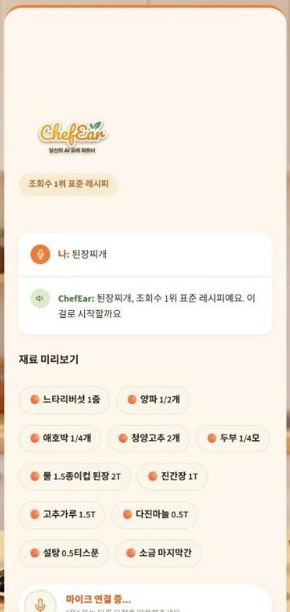
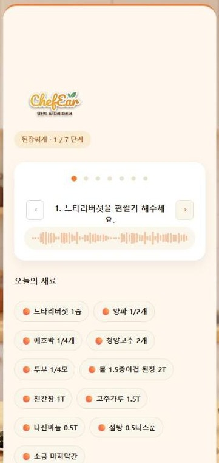
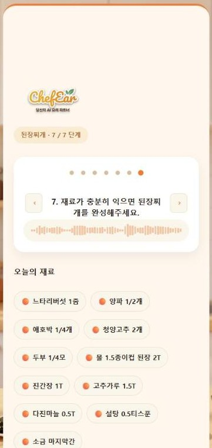
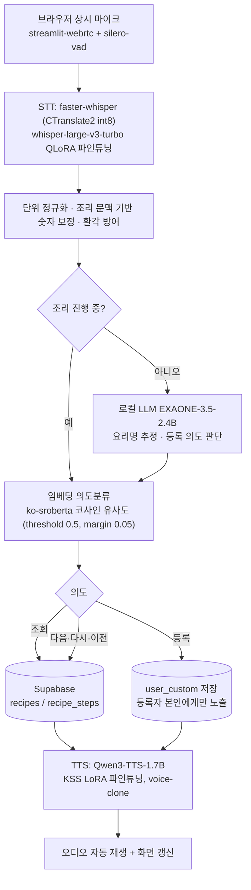

# 👨‍🍳 ChefEar (셰프이어)

> 손에 물기와 재료가 묻어 화면을 볼 수 없는 순간에도, 음성만으로 레시피를 한 단계씩 안내받는 음성 레시피 에이전트.
> STT(Whisper)와 TTS(Qwen3-TTS)를 요리 도메인으로 직접 파인튜닝했고, GPU 서버에서 상시 배포 중입니다.

| | |
|---|---|
| 과정 | AI Human 7기 · 1차 팀 프로젝트(딥러닝 기반 TTS·STT 서비스) · A조 |
| 기간 | 2026-08-14 ~ 08-30 (발표 08-31) · 09-01 ~ 09-08 마무리 작업 |
| 서비스 | [chefear-landingpage.vercel.app](https://chefear-landingpage.vercel.app) → [chefear.store](https://chefear.store) |
| 저장소 상태 | 최종 정리본(2026-09-10). 기능 개발 종료, 문서·코드 정리 완료 |

---

## 1. 한눈에 보기

```
사용자: "된장찌개 만드는 법 알려줘"
ChefEar: "된장찌개, 표준 레시피예요. 이걸로 시작할까요?"
사용자: "응"
ChefEar: "일단계, 두부와 감자를 깍둑썰기 해주세요."   ← 조리 용어는 짧은 설명을 함께 읽어줌
사용자: "다음" / "다시" / "이전"                        ← 정해진 명령어가 아니라 자유발화
```

- **음성만으로 진행** — 브라우저 상시 마이크(WebRTC)와 VAD가 발화를 자동으로 잘라 STT로 넘기고, 응답은 TTS로 바로 재생됩니다. 버튼을 누를 필요가 없습니다.
- **자유발화 이해** — "다음꺼", "한 번 더", "아까 거"처럼 표현이 달라도 임베딩 유사도로 의도를 판단합니다.
- **도메인 파인튜닝** — 요리명·재료명·계량단위·조리동작을 일반 모델보다 정확히 듣고(STT), 자연스럽게 읽습니다(TTS).
- **정직한 데이터** — 조리순서는 저장된 500개 큐레이션 레시피에서 조회만 합니다. 없으면 "없다"고 답하고, 런타임에 문장을 생성하지 않습니다.
- **외부 LLM API 없음** — 서비스 실행 중 OpenAI·Gemini 등 외부 API를 호출하지 않습니다. 요리명 추정은 GPU에 직접 올린 로컬 LLM(EXAONE 2.4B)이 담당합니다.

### 화면 흐름

| 로그인 | 시작 | 음성 처리 중 | 레시피 확인 |
|---|---|---|---|
|  |  |  |  |

| 조리 1/7 단계 | 조리 7/7 단계 | 요리 완성 | 관리자 음성 인증 |
|---|---|---|---|
|  |  |  |  |

| 등록 · 재료 | 등록 · 조리 순서 | 등록 완료 | 마이레시피 |
|---|---|---|---|
|  |  |  |  |

2026-10-08 로컬(RTX 5070 12GB, GPU 워커 1개)에서 캡처했습니다. 음성 입력은 녹음 파일을 실제 STT에 넣어 진행했고, 검색·조리·관리자 화면은 실제 DB, 등록·마이레시피는 테스트 계정과 mock DB입니다. 배경까지 담긴 원본 16장은 `docs/images/flow/`에 있습니다.

## 2. 팀과 역할

| 이름 | 역할 | 실제 기여(커밋 이력 기준) |
|---|---|---|
| **김승욱** (조장) | 오케스트레이션·통합 / STT 파인튜닝 / 배포 | 의도분류·레시피 검색·등록 로직, 상시 마이크 파이프라인, GPU 워커 풀, Whisper QLoRA 파인튜닝과 평가, Docker·RunPod·Cloudflare 배포, 500건 데이터 큐레이션, 문서 전반 (266 커밋) |
| **홍민하** | TTS 파인튜닝 / UI / 계정 | Qwen3-TTS LoRA 파인튜닝과 체크포인트 검증, Streamlit 화면·테마, 로그인·구글 OAuth·마이레시피, 소유자 격리 보안 수정 (58 커밋) |
| **하주성** | STT 평가·데이터 | Fixed100 검증셋(문장 100개 + 음성) 구축, STT 학습 환경 고정, 단위 정규화·문맥 기반 숫자 보정 후처리, 랜딩페이지 (19 커밋, 08-24까지 참여) |

과제 마감은 08-31 발표였고, 09-01 ~ 09-08의 작업은 김승욱·홍민하 두 사람이 강의 종료 후 이어서 진행한 것입니다. 발표 시점의 배포 상태(로컬 12GB GPU, 락 기반 동시성, 6만 건 미검수 데이터, 계정 없는 등록)를 그대로 두지 않기 위한 마무리였고, 지금 배포된 버전은 이 기간의 결과입니다. 작업 내역은 6장 ⑥.

## 3. 문제 정의

요리 경험이 거의 없는 초보자는 칼질·반죽처럼 손을 쓰기 어려운 순간마다 화면을 확인하러 조리를 멈춥니다. 손을 씻고 화면을 보는 사이 반죽 농도나 양념 타이밍처럼 되돌릴 수 없는 손실이 생깁니다. ChefEar의 목표는 시간 절약이 아니라 **첫 시도부터 완성도를 잃지 않게 하는 것**입니다.

| 경쟁 서비스 | 한계 | ChefEar |
|---|---|---|
| 레시피오 | 텍스트 채팅형, 화면을 봐야 함 | 음성 출력 중심 |
| 레시핏 | 음성 핸즈프리지만 정해진 명령어, 유튜브 변환이라 품질 미검증 | 자유발화 + 큐레이션 데이터 |
| 만개의레시피 | 음성은 레시피 작성용, 안내용 아님 | 조리 진행 전체가 음성 |

## 4. 아키텍처



**GPU 실행 구조.** STT·임베딩·로컬 LLM·TTS 네 모델을 별도 프로세스 워커 풀(기본 3개, `spawn`)에서 돌립니다. Streamlit 메인 프로세스는 마이크 프레임만 받고, 추론은 `Future`로 기다립니다. 처음에는 스레드 락 하나로 직렬화했는데 GIL 경합 때문에 마이크 큐가 넘치는 문제가 재현되어 프로세스 분리로 옮겼습니다(6장 참고).

**데이터 흐름.** 조리 단계 텍스트에는 `[TERM:깍둑썰기]` 같은 태그가 붙어 있고, TTS로 읽을 때는 짧은 설명("사방 1~2cm 정육면체로 써는 방법")을 붙여 읽고 화면에는 용어만 표시합니다.

## 5. 딥러닝 파인튜닝과 평가

### 5.1 STT — `openai/whisper-large-v3-turbo` QLoRA

| 항목 | 내용 |
|---|---|
| 방식 | QLoRA(4-bit NF4), r=16 / alpha=64 / dropout=0.05, target=q_proj·k_proj·v_proj·out_proj |
| 학습 데이터 | 요리 조리문 텍스트(재료·계량·조리동작 위주)를 TTS로 읽어 만든 합성 음성. train300 → train1000 → 숫자·단위 보강 250 → 최종 MIX750(리플레이 500 + 숫자보강 250, LR 1e-5) |
| 검증셋 | Fixed100(저장소에 커밋됨: `data/evaluation_scripts/stt/`) · 신규500 |
| 배포 | LoRA 병합 → CTranslate2 int8 변환(`src/stt/export_ct2.py`) → faster-whisper GPU 추론 |

| 체크포인트 | Fixed100 WER | Fixed100 CER | 신규500 WER | 신규500 CER | 숫자·단위 정확도 |
|---|---|---|---|---|---|
| 기준(2 epoch) | 33.20% | 5.81% | — | — | — |
| train300 | 10.68% | 2.21% | 13.97% | 3.05% | 70.75% |
| train1000 | 7.26% | 1.49% | 10.98% | 2.33% | 86.79% |
| reinforce250 | 8.20% | 1.54% | 11.07% | 2.32% | 90.57% |
| **MIX750 (최종)** | **7.68%** | **1.44%** | **10.72%** | **2.26%** | **90.57%** |

핵심정보 인식률(MIX750, 신규500): 재료명 98.31% · 조리동작 99.54% · 숫자·단위 90.57% · 종합 96.23%.

비교 실험: Whisper Small(경량 비교군), wav2vec2(구조 비교군, 숫자·단위·일부 한국어 음절 처리 한계로 중단). V1 어댑터 위에 신규 300문장으로 V2 추가 학습도 했으나 개선이 없어 V1(MIX750)을 최종 채택했습니다.

**재현 가능한 수치.** 배포 중인 int8 모델을 저장소의 Fixed100으로 다시 돌린 결과입니다(`python src/stt/evaluate_fixed100.py`, 결과 `results/stt/`). 위 표는 학습 환경의 4-bit 어댑터 기준이고 아래는 int8 변환본이라 수치가 다릅니다.

| 배포 모델(CTranslate2 int8) | Fixed100 WER | Fixed100 CER | 완전 일치 | 문장당 추론 |
|---|---|---|---|---|
| MIX750 int8 (2026-09-10 재측정) | 11.83% | 1.81% | 55/100 | 0.34초 (RTX 5070) |

### 5.2 TTS — `Qwen3-TTS-12Hz-1.7B-Base` LoRA

| 항목 | 내용 |
|---|---|
| 방식 | LoRA 파인튜닝 후 merge_and_unload, KSS 데이터셋(12,854문장, 24kHz 리샘플링), Colab A100 |
| 체크포인트 | epoch-8 → epoch-24(과적합, 반복 발화) → **epoch-13 채택** |
| 추론 | qwen-tts 0.1.1, bfloat16, KSS 화자 참조 음성으로 voice-clone, `max_new_tokens`를 문장 길이 비례로 동적 계산 |

TTS → STT 재인식 CER(5문장): epoch-8 평균 1.37 → epoch-24 평균 14.26 → **epoch-13 전부 0.00**.

파인튜닝 방식 비교(N=30~100, 별도 실험 공간):

| 모델 | WER | CER | MOS |
|---|---|---|---|
| Qwen3-TTS Base | 0.27 | 0.08 | 4.33 |
| Full FT | 0.48 | 0.22 | 2.10 (회귀) |
| **LoRA FT (채택)** | 0.26 | 0.10 | **4.67** |
| QLoRA FT | 0.27 | 0.12 | 4.17 |

블라인드 MOS(13명, 모델당 10문항, 총 909건): Qwen3 LoRA 4.67 > Base 4.33 > QLoRA 4.17 > Full FT 2.10 > vits-kss 1.45 > Chatterbox 1.05. 지인 편의표본이라 통계적 대표성은 없습니다. 집계 대시보드는 `results/tts/mos/`.

응답 속도(RTX 5070, 4문장 평균): eager 6.34초 → SDPA 5.48초 → `torch.compile(dynamic=True)` 5.21초. 목표 5초에 근접했으나 긴 문장은 여전히 초과합니다. CPU는 26초로 배포 불가 판정을 내려 GPU 상시 배포로 방향을 잡았습니다.

### 5.3 학습 코드의 위치

STT·TTS 학습은 Colab과 개인 작업 공간의 노트북·스크립트로 진행했고, 이 저장소에는 학습 설정(`docs/stt.md`, `src/stt/README.md`, `src/tts/README.md`)과 평가 자산(Fixed100 검증셋, 평가 스크립트, 결과 CSV·대시보드)만 포함되어 있습니다. 학습 스크립트 파일은 저장소에 없습니다.

## 6. 기술적 의사결정

**① 외부 LLM API 금지를 어떻게 풀었나.** 과제 요건상 서비스 응답 경로에 외부 LLM API를 넣을 수 없었습니다. 의도분류는 `jhgan/ko-sroberta-multitask` 임베딩과 110개 기준 예문의 코사인 유사도로 처리하고, 1위 점수가 0.5 미만이거나 2위와 차이가 0.05 미만이면 임의로 고르지 않고 되묻습니다. 자유발화 속 요리명 추정만 로컬 LLM(EXAONE-3.5-2.4B, `transformers`로 GPU에 직접 로드)에 맡겼습니다.

**② TTS epoch-24 회귀.** 더 오래 학습한 epoch-24 체크포인트에서 재인식 CER이 1.37에서 14.26으로 튀고 같은 말을 반복하는 발화가 늘었습니다. 화자 임베딩 테이블이 바뀐 것과 과적합을 원인으로 잡고 epoch-13으로 되돌렸으며, 추론 방식도 화자명 지정에서 참조 음성 voice-clone으로 바꿨습니다. 결과는 5문장 CER 0.

**③ Queue overflow와 GIL.** 사용자가 늘면 STT·TTS·LLM 추론이 겹쳐 마이크 프레임 큐가 넘쳤습니다. 모델별로 락을 4개로 나눠 병렬화했더니 오히려 GIL 경합으로 마이크 드레인 스레드가 굶어 재발했습니다. 원인이 락이 아니라 GIL이라는 걸 확인하고 추론을 별도 프로세스 풀(`src/orchestration/gpu_worker_pool.py`)로 옮겨 해결했습니다. 워커가 죽으면 풀을 자동 재생성합니다.

**④ 60,282건에서 500건으로.** 처음에는 만개의레시피 고유 요리명 60,282건 전량을 적재했습니다. 원본에는 조리순서 텍스트가 없어 ChatGPT로 오프라인 생성해 채웠는데, 6만 건의 품질을 사람이 검수할 수 없다는 판단이 섰습니다. 9월 1일 한국 가정식 500개로 범위를 줄이고, 재료 목록 기반 규칙으로 조리순서 2,950단계를 생성한 뒤 조리 용어 926개에 설명 태그를 붙여 전면 교체했습니다. 적은 데이터를 확실하게 만드는 쪽을 택한 결정입니다.

**⑤ 계정 기능을 뺐다가 다시 넣은 이유.** 08-27에 화면 전환 잔상 버그와 "누가 등록했는지 쓰지 않는다"는 결정으로 로그인을 제거하고 관리자 승인 모델로 갔습니다. 잔상 버그를 `st.empty()` 슬롯 방식으로 근본 해결한 뒤 09-01에 로컬 가입 + 구글 OAuth 로그인과 마이레시피를 재도입했고, 09-02부터 등록은 로그인 필수, 등록한 레시피는 본인에게만 보이는 구조로 바꿨습니다. 관리자 승인 페이지는 그 이전 레거시 데이터 처리용으로만 남아 있습니다.

**⑥ 마감 이후의 마무리(09-01 ~ 09-08).** 발표 시점의 로컬 데스크탑(RTX 5070, 12GB)은 워커 하나가 VRAM 10GB를 써서 동시 사용자를 받을 수 없었고, 락 방식은 Queue overflow를 반복했습니다. 두 사람이 8일간 이어서 한 일은 다음과 같습니다.

| 날짜 | 작업 | 담당 |
|---|---|---|
| 08-31 | 멀티스테이지 Docker 이미지(Python 3.13 소스 빌드, CUDA 12.4), GitHub Actions → GHCR, RunPod A40(48GB) 이관, 저장소를 Organization으로 이전 | 김승욱 |
| 09-01 | 스레드 락 → GPU 프로세스 워커 풀, PeerConnection 누적 크래시 근본 수정, 60,282건 → 500건 큐레이션 데이터 교체와 조리 용어 태깅 | 김승욱 |
| 09-01 | 로컬 가입 + 구글 OAuth 로그인, 마이레시피(목록/수정/삭제) 재도입 | 홍민하 |
| 09-02 | 등록 로그인 필수·본인 전용 노출로 전환, 관리자 승인은 레거시 전용으로 | 홍민하 |
| 09-02 ~ 09-04 | TTS 끝음절 잘림 원인 추적(무음 패딩·더미 기호 등 우회 시도 후 캐시 파일 동시 쓰기 레이스로 확정), 조리 단계 번호 한글 낭독, 프리페치 병렬화 | 김승욱 |
| 09-07 ~ 09-08 | flash-attn 사전빌드 휠 적용, 워커 풀 자동 복구, 소유자 격리 보안 결함(IDOR·비로그인 노출) 수정 | 김승욱·홍민하 |

이 기간의 결과가 지금 `chefear.store`에 올라가 있는 버전입니다.

## 7. 기능 범위

**포함**: 자유발화 조회 · 단계 진행(다음/다시/이전, 1단계에서 이전은 유지) · 조리 중 다른 요리로 전환 금지 · 조리 용어 설명 · 음성 실패 시 수동 버튼 · 로컬/구글 로그인 · 레시피 등록(요리명→재료→순서, 로그인 필수) · 마이레시피(목록/수정/삭제) · 관리자 페이지(토큰 + ECAPA-TDNN 화자검증 2단계, 레거시 승인 대기 행 처리 전용).

**제외(팀 결정)**: 재료 대체(08-27 제거) · 사진 등록 · 타이머 · 바지인(TTS 중 끼어들기) · 판매/결제 · 데이터 밖 요리의 조리순서 실시간 생성.

## 8. 기술 스택

| 구분 | 선택 | 비고 |
|---|---|---|
| STT | whisper-large-v3-turbo + QLoRA → CTranslate2 int8 / faster-whisper 1.2.1 | GPU 전용 |
| TTS | Qwen3-TTS-12Hz-1.7B + LoRA / qwen-tts 0.1.1 | bfloat16, voice-clone |
| 의도분류 | sentence-transformers 5.6.1, `jhgan/ko-sroberta-multitask` | LLM 아님 |
| 요리명 추정 | EXAONE-3.5-2.4B-Instruct (로컬) | `transformers.AutoModelForCausalLM` |
| 관리자 화자검증 | speechbrain ECAPA-TDNN | CPU |
| 상시 마이크 | streamlit-webrtc 0.77.0 · silero-vad 6.2.1 · aiortc 1.15.0 | Cloudflare Realtime TURN |
| UI | Streamlit 1.61.1, Python 3.13 | 화면 전환 잔상은 `st.empty()` 슬롯으로 대응 |
| DB | Supabase 2.31.0 (`recipes`/`recipe_steps`/`users`) | SQL 함수 없이 Python 필터 |
| 배포 | Docker(CUDA 12.4) · RunPod A40 · GHCR · Cloudflare Tunnel · Vercel 랜딩 | `docs/runpod_deploy.md` |
| 테스트 | pytest 119개(GPU 불필요, mock DB) | `pytest tests/` |

## 9. 실행 방법

### 9.1 Docker (권장, RunPod와 동일 이미지)

```bash
docker build -t chefear .
docker run --gpus all --env-file .env -p 8501:8501 chefear
```

### 9.2 로컬 GPU

```bash
git clone https://github.com/chefear-team/ChefEar_ai.git && cd ChefEar_ai
python3.13 -m venv .venv && source .venv/bin/activate
pip install torch==2.6.0 torchvision==0.21.0 torchaudio==2.6.0 --index-url https://download.pytorch.org/whl/cu124
pip install -r requirements.txt -r requirements-main.txt
cp .env.example .env        # 아래 값을 채운다
./run_local.sh              # CUDA 라이브러리 경로를 잡아 streamlit run src/app.py 실행
```

| 환경변수 | 필수 | 설명 |
|---|---|---|
| `SUPABASE_URL` / `SUPABASE_KEY` | 필수 | 없으면 인메모리 mock DB로 폴백(테스트용) |
| `HF_STT_CT2_REPO` | 필수 | 배포용 STT 모델 저장소(`kimseunguk/chefear-stt-ct2-int8`) |
| `HF_TOKEN` | 필수 | STT·TTS 모델 저장소가 private |
| `HF_TTS_MODEL_REPO` | 선택 | 기본값 `kimseunguk/qwen3-tts-kss-finetuned` |
| `GPU_WORKER_COUNT` | 선택 | 워커 프로세스 수, 기본 3 (워커당 VRAM 약 10GB) |
| `CF_TURN_KEY_ID` 등 | 선택 | 원격 접속 마이크용 TURN |
| `ACCESS_GATE_TOKEN` | 선택 | 랜딩페이지를 거친 접속만 허용 |
| `ADMIN_ACCESS_TOKEN` / `ADMIN_ENROLL_TOKEN` / `ADMIN_VOICE_THRESHOLD` | 선택 | 관리자 페이지 2단계 인증 |

Python 3.13이 필요합니다(상시 마이크가 의존하는 aioice가 3.14를 지원하지 않음). CUDA GPU가 없으면 STT 로딩 단계에서 종료됩니다.

### 9.3 테스트와 평가

```bash
pytest tests/                              # 단위테스트 119개, GPU·DB 불필요
python src/stt/evaluate_fixed100.py        # 배포 STT를 Fixed100으로 재평가 (GPU, .env 필요)
python tests/tts_stt_roundtrip_test.py     # TTS→STT 재인식 CER (GPU)
```

## 10. 저장소 구조

```
src/app.py                  서비스 엔트리포인트
src/orchestration/          의도분류·레시피 검색·등록·계정·GPU 워커 풀·DB
src/stt/                    STT 추론(faster-whisper), CT2 변환, Fixed100 평가
src/tts/                    TTS 추론(Qwen3-TTS), 발음 보정
src/llm/                    로컬 LLM(EXAONE) 로드·추론
src/ui/                     Streamlit 화면 컴포넌트(세션·음성IO·디스패처·화면)
ui/theme.py, ui/mic_vad.py  공용 스타일 · VAD 세그먼터
db/schema.sql               Supabase DDL, 500건 교체 마이그레이션
data/                       기준예문, Fixed100 검증셋, MOS 원자료, 500건 CSV는 docs/
results/                    STT·TTS 평가 결과 CSV와 대시보드
docs/                       PRD/SDD, 설계서, 팀 가이드, 스펙, 배포 문서, 발표 자료
tests/                      pytest 스위트 + GPU 벤치마크 스크립트
landing/                    소개 페이지(Streamlit, Vercel 배포본과 동일 내용)
```

## 11. 한계와 정직한 기록

- 학습 스크립트는 저장소 밖(Colab·개인 작업 공간)에 있어 가중치 재학습은 이 저장소만으로 재현되지 않습니다. 평가는 재현됩니다(5.1).
- STT 기준선은 파인튜닝 2 epoch 시점이며, 원본 모델 zero-shot 수치는 측정하지 않았습니다.
- 조리순서 텍스트는 실데이터가 아니라 재료 목록 기반 규칙 생성이며, 요리명·재료·조회수만 만개의레시피 실데이터입니다.
- TTS 응답은 문장 길이에 따라 5초를 넘길 수 있고, 종단(STT+LLM+TTS) 응답 시간은 정식으로 측정하지 않았습니다.
- 모델 저장소가 private라 실행에는 팀 토큰이 필요합니다.
- MOS는 지인 13명 편의표본입니다.
- 마이레시피 수정 화면에서 저장하면 조리 용어 태그(`[TERM:...]`)가 별도 단계로 떨어져 나가는 버그가 남아 있습니다. 수정 방향은 `docs/specs/edit_recipe_term_tag.md`에 정리했고 아직 고치지 않았습니다.

## 12. 라이선스·윤리

| 대상 | 라이선스 | 비고 |
|---|---|---|
| Whisper | MIT | 상업적 이용 가능 |
| Qwen3-TTS | Apache 2.0 | 상업적 이용 가능 |
| EXAONE-3.5-2.4B-Instruct | EXAONE AI Model License 1.1-NC | 비상업 전용, 수업 과제로 충족 |
| KSS | CC BY-NC-SA 4.0 | 비상업, 팀원 목소리 미사용 |
| 만개의레시피(KADX) | 정식 유통 경로 | 요리명·재료·조회수만 사용 |

서비스 실행 중 외부 LLM API 호출 없음. 관리자 성문(음성 임베딩)은 저장소에 커밋하지 않습니다.

---

문서 안내: [`docs/ChefEar_PRD_SDD_v0.9.md`](docs/ChefEar_PRD_SDD_v0.9.md)(요구사항·설계) · [`docs/ChefEar_설계서.md`](docs/ChefEar_설계서.md)(배포 관점 요약) · [`docs/ChefEar_팀_진행_가이드_v3.md`](docs/ChefEar_팀_진행_가이드_v3.md)(온보딩) · [`docs/decisions.md`](docs/decisions.md)(의사결정 기록) · [`docs/runpod_deploy.md`](docs/runpod_deploy.md)(배포 절차) · [`docs/specs/`](docs/specs/README.md)(기능 스펙) · [`docs/presentation/`](docs/presentation/)(발표 자료)
