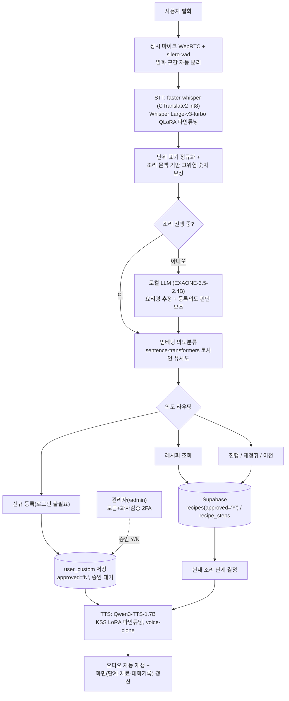

# 👨‍🍳 ChefEar (셰프이어)

> 손에 물기·재료가 묻어 화면을 볼 수 없는 순간에도, 음성만으로 레시피를 한 단계씩 안내받는 음성 레시피 에이전트. STT(Whisper)·TTS(Qwen3-TTS) 도메인 파인튜닝을 마치고 팀 GPU 데스크탑에서 상시 배포 중입니다.

## 팀 소개

| 항목 | 내용 |
|---|---|
| 프로젝트 | ChefEar (AI Human 7기 A조) |
| 조장 | 김승욱 |
| 조원 | 홍민하, 하주성 |

| 이름 | GitHub | 역할 | 담당 업무 |
|---|---|---|---|
| 김승욱 | [@seungwook-kim](https://github.com/seungwook-kim) | 조장 / 오케스트레이션·통합 | 의도분류, 단계 진행 로직, Supabase 검색, 배포 및 통합테스트 |
| 홍민하 | [@minhahamin](https://github.com/minhahamin) | TTS 파인튜닝 / UI | Qwen3-TTS-12Hz-1.7B + KSS 학습 환경 구성 및 파인튜닝, Streamlit UI 구현 |
| 하주성 | [@leeony2636](https://github.com/leeony2636) | STT 파인튜닝 | Whisper Small·wav2vec2 비교 실험, whisper-large-v3-turbo QLoRA 파인튜닝, Fixed100/New500 WER·CER 평가 및 최종 STT 모델 선정 |

## 🟢 배포 상태

| | |
|---|---|
| 지금 써보기 | **[chefear-landingpage.vercel.app](https://chefear-landingpage.vercel.app)** — 랜딩페이지 버튼을 거쳐 접속 링크로 안내됩니다 |
| 서비스 도메인 | [chefear.store](https://chefear.store) (Cloudflare Tunnel로 팀 GPU 데스크탑에 상시 연결) — 직접 URL로 들어오면 접근 게이트가 막으므로, 위 랜딩페이지를 거쳐 들어와야 합니다 |
| 마지막 확인 | 2026-08-27, 서버 응답 정상(HTTP 200) — 클라우드 매니지드 호스팅이 아니라 팀 개인 GPU 데스크탑 기반 상시 구동이라 24/7 가동률을 보장하지는 않습니다 |

## 문제 정의

요리 경험이 거의 없는 초보자는 칼질·반죽 등으로 손을 쓰기 어려운 순간마다 화면을 다시 확인하러 조리를 멈추게 되고, 그사이 반죽 농도·양념 타이밍 같은 되돌릴 수 없는 완성도 손실을 겪고 있으므로, 화면 없이 음성만으로 레시피를 단계별로 안내하는 ChefEar가 필요하다.

> PRD §1 Job To Be Done 원문: "요리 경험이 전무한 사람이, 처음 도전하는 요리에서 손이 바쁜 순간에도 화면을 다시 보지 않고 다음에 뭘 해야 할지 정확히 안내받아, 첫 시도부터 완성도를 잃지 않도록 돕는 것." (`docs/ChefEar_PRD_SDD_v0.8.md`)

## 데모

> ⚠️ 아직 실제 사용 영상/음성 샘플이 저장소에 없습니다 — 발표 전 팀에서 짧은 사용 영상이나 음성 샘플 링크를 추가해 이 섹션을 채워주세요. 음성 서비스라 스크린샷만으로는 무엇을 하는지 전달되지 않습니다.

글 대신, 실제 시나리오 한 번의 대화 흐름으로 대신합니다.

```
사용자: "된장찌개 만드는 법 알려줘"
ChefEar: (레시피 검색 → 개요 안내 → 조리 시작 여부 확인) "1단계, 물을 끓여주세요"

사용자: "다음"
ChefEar: (다음 단계 안내)

사용자: "다시 알려줘"
ChefEar: (현재 단계 재청취)

요리 완료
```

## 핵심 기능

- **화면 없이 음성만으로 진행** — 상시 마이크(streamlit-webrtc + silero-vad)가 세션당 한 번만 연결되어 화면이 전환돼도 유지되고, 발화 구간을 자동으로 분리해 STT로 넘긴다.
- **자연스러운 진행/재청취** — "다음", "다시", "이전" 등 정해진 명령어 없이 자유발화로 조리 단계를 오가고, 1단계에서 "이전"을 말해도 현재 단계를 유지하는 등 예외를 처리한다.
- **로그인 없는 신규 레시피 등록 + 관리자 승인** — 누구나 발화만으로 요리명·재료·순서를 등록할 수 있고, 등록된 레시피는 관리자가 승인(Y/N)해야 조회에 노출된다(악의적/저품질 등록으로부터 표준 데이터를 보호).
- **관리자 페이지 2단계 인증** — 접근 토큰(1차) + 랜덤 한글 단어 3개를 읽는 화자검증(ECAPA-TDNN, 2차)으로만 승인/삭제 화면에 들어갈 수 있다.
- **요리 도메인 파인튜닝 STT·TTS** — Whisper·Qwen3-TTS 모두 요리명·재료명·계량단위·진행 표현으로 파인튜닝되어 일반 모델보다 정확히 인식하고 자연스럽게 안내한다.
- **60,282개 요리명 실데이터 커버리지** — 만개의레시피(KADX) 조리순서 전량을 조회 대상으로 하며, 동일 요리명이 여럿이면 조회수 1위를 되묻지 않고 표준으로 채택한다.

계정 로그인/회원가입/개인화 저장, 재료 대체 기능은 팀 결정으로 범위에서 제거했다(`docs/specs/remove_user_accounts.md`, `docs/specs/remove_ingredient_substitution.md`).

## 아키텍처 / 파이프라인



의도분류(임베딩 유사도)와 로컬 LLM(EXAONE) 모두 서비스 실행 중 외부 서버로 텍스트를 보내지 않는다 — 전자는 API 자체가 아니고, 후자는 팀 GPU에 직접 올려 완전히 로컬로 추론한다. 조리순서 제공은 실데이터 검색으로만 처리하며, STT·임베딩·로컬 LLM·TTS 넷이 한 GPU를 공유해 단일 락(`_GPU_LOCK`)으로 동시 추론을 직렬화한다(한때 모델별로 락을 4개로 쪼갰다가 "Queue overflow"가 재현돼 되돌렸다). 사용자 등록 레시피는 관리자가 별도 페이지(`/admin`, 토큰+음성 화자검증 2FA)에서 승인해야 일반 조회에 노출된다.

## 모델 · 기술 스택

| 구분 | 모델/패키지 | 비고 |
|---|---|---|
| STT | `openai/whisper-large-v3-turbo` (QLoRA 4-bit NF4 파인튜닝) | 배포는 CTranslate2 int8 변환 후 faster-whisper 1.2.1로 GPU 추론 |
| TTS | `Qwen3-TTS-12Hz-1.7B` (KSS 데이터셋 LoRA 파인튜닝 후 merge) | qwen-tts 0.1.1, GPU(bfloat16) voice-clone 방식 추론 |
| 의도분류 | `jhgan/ko-sroberta-multitask` (sentence-transformers 5.6.1) | LLM 아님 — 코사인 유사도, threshold 0.5 + margin 0.05 |
| 요리명 추정·등록의도 보조 | `LGAI-EXAONE/EXAONE-3.5-2.4B-Instruct` | 팀 GPU에 `transformers.AutoModelForCausalLM`으로 직접 로드, 외부 API 아님 |
| 관리자 화자검증 | `speechbrain/spkrec-ecapa-voxceleb` (ECAPA-TDNN) | CPU 추론 — GPU 4종이 이미 VRAM을 거의 다 써서 분리, `/admin` 2FA 전용 |
| DB | Supabase 2.31.0 | `recipes`(`approved` 컬럼으로 승인 여부) / `recipe_steps`, SQL RPC 대신 Python 필터(`.eq()`/`.ilike()`/`.range()`) |
| UI/배포 | Streamlit 1.61.1 (`src/app.py`) | 팀 GPU 데스크탑(RTX 5070, 12GB VRAM) 상시 구동 + Cloudflare Tunnel |
| 상시 마이크 | streamlit-webrtc 0.77.0 + silero-vad 6.2.1 + aiortc 1.15.0 | 세션당 1회 연결, 화면 전환에도 유지 |
| 평가 | jiwer 4.0.0 | STT/TTS 파인튜닝 전/후 WER/CER 비교 |

### 비교 실험 — STT

Whisper Small(경량 비교군)과 wav2vec2(구조 비교군)를 Whisper Large-v3-turbo와 나란히 실험했다.

| 모델 | 역할 | 결과 |
|---|---|---|
| Whisper Small | 경량 비교군 | 비교 실험 완료 |
| wav2vec2 | 구조 비교군 | 숫자·단위·일부 한국어 음절 처리에서 한계 확인, 추가 실험 중단 |
| **Whisper Large-v3-turbo (QLoRA 파인튜닝)** | **최종 채택** | Fixed100 / 신규500 기준 WER·CER 가장 안정적 |

**파인튜닝 진행 — 최종 채택 모델(Whisper Large-v3-turbo, QLoRA)**

| 체크포인트 | Fixed100 WER | Fixed100 CER | 신규500 WER | 신규500 CER | 숫자·단위 정확도 |
|---|---|---|---|---|---|
| 기준 (2epoch) | 33.20% | 5.81% | — | — | — |
| train300 (Epoch4) | 10.68% | 2.21% | 13.97% | 3.05% | 70.75% |
| train1000 BEST | 7.26% | 1.49% | 10.98% | 2.33% | 86.79% |
| reinforce250 | 8.20% | 1.54% | 11.07% | 2.32% | 90.57% |
| **MIX750 (최종 채택, `BEST_FINAL_mix750_replay_numeric`)** | **7.68%** | **1.44%** | **10.72%** | **2.26%** | **90.57%** |

기준(2epoch) 대비 신규500 WER이 33.20%→10.72%로 개선됐다. train1000은 Fixed100 WER 자체는 가장 낮았지만(7.26%) 숫자·단위 정확도가 86.79%에 그쳤고, reinforce250은 숫자·단위를 90.57%까지 올렸지만 일반화 성능이 소폭 나빠졌다 — MIX750은 Replay 500개 + 숫자보강 250개를 LR 1e-5로 추가 학습해 숫자·단위 정확도(90.57%)를 유지하면서 신규500 WER·CER도 가장 낮게 유지해 최종 모델로 선정됐다.

**ChefEar 핵심정보 인식률(MIX750, 신규500 기준)**

| 항목 | 정확도 |
|---|---|
| 재료명 | 98.31% |
| 조리동작 | 99.54% |
| 숫자·단위 | 90.57% |
| **핵심정보 종합** | **96.23%** |

### 비교 실험 — TTS

TTS→STT 재인식(CER)으로 체크포인트를 검증했다 — epoch-24에서 화자 임베딩 문제로 품질이 급격히 나빠졌고, 13에포크로 되돌려 해결했다.

| 문장 | epoch-8 CER | epoch-24 CER | 13에포크 CER |
|---|---|---|---|
| 약불로 5분간 끓여주세요 | 1.00 | 40.36 | **0.00** |
| 양파와 마늘을 볶아주세요 | 0.70 | 18.70 | **0.00** |
| 1.5컵의 물을 넣고 뜸을 들여주세요 | 5.84 | 0.92 | **0.00** |
| 두부와 감자를 썰어 넣습니다 | 0.05 | 10.05 | **0.00** |
| 된장을 풀어줍니다 | 0.00 | 1.25 | **0.00** |
| **평균** | **1.37** | **14.26** | **0.00** |

추론 속도(목표: 5초 이내)는 CPU에서는 목표에 못 미쳐 GPU 상시 배포로 방향을 전환했다(`docs/decisions.md` #2).

| 환경 | 조건 | 평균 응답시간 |
|---|---|---|
| CPU | 4문장, 구 code path | 197.48초 |
| CPU | 4문장, 최신 code path | 26.11초 |
| GPU (RTX 5070) | eager | 6.34초 |
| GPU (RTX 5070) | + SDPA | 5.48초 |
| GPU (RTX 5070) | + `torch.compile(dynamic=True)` | **5.21초** |

### 모델 비교 — 파인튜닝 방식 및 후보 TTS 모델 전체

Qwen3-TTS를 Full FT/LoRA FT/QLoRA FT로 나눠 base와 비교하고, vits-kss·Chatterbox도 후보에 놓고 함께 평가했다(팀 정량 평가 대시보드, 생성 2026-08-21·MOS 갱신 2026-08-25). 아래 파인튜닝 방식 비교표는 **이 저장소가 아니라 별도 개인 실험 공간(`test/`, checkpoint-epoch-2)**에서 측정한 기록이다

| 모델 (파인튜닝 방식) | N | WER | CER | Accuracy | MOS |
|---|---|---|---|---|---|
| Qwen3-TTS Base | 30 | 0.27 | 0.08 | 73.1% | 4.33 |
| Qwen3-TTS Full FT | 30 | 0.48 (▲0.21) | 0.22 (▲0.14) | 56.1% (▼17.0%p) | 2.10 — **회귀** |
| **Qwen3-TTS LoRA FT (비양자화, ChefEar가 채택한 방식)** | 100 | 0.26 (▼0.01) | 0.10 (▲0.02) | 74.5% (▼0.5%p) | — (미측정) |
| Qwen3-TTS QLoRA FT | 100 | 0.27 (▲0.00) | 0.12 (▲0.04) | 72.6% (▼0.5%p) | 4.17 |

Full FT는 base 대비 WER·CER·MOS가 뚜렷하게 나빠지는(회귀) 반면, LoRA·QLoRA FT는 base와 오차범위 안에서 동등하다 — ChefEar가 실제로 채택한 LoRA 파인튜닝이 품질 손실 없이 안전한 선택이었음을 뒷받침한다.

같은 대시보드에서 후보 TTS 모델 7종을 지인 네트워크 13명이 모델명을 가린 블라인드로 채점했다(모델당 10문항, n=129~130, 총 909건 — 편의표본이라 무작위 사용자 평가는 아님):

| 모델 | MOS (1~5) |
|---|---|
| **Qwen3 LoRA (ChefEar 실사용)** | **4.67 — 전체 1위** |
| Qwen3-TTS Base | 4.33 |
| Qwen3-TTS QLoRA FT (`test/` epoch-2) | 4.17 |
| Qwen3-TTS Full FT | 2.10 |
| vits-kss | 1.45 |
| Chatterbox Full FT | 1.05 |
| Chatterbox LoRA FT | 1.04 |

vits-kss는 RTF<1(실시간보다 빠름)로 유일하게 속도 조건은 만족했지만 MOS가 낮았고, Chatterbox 두 변형은 WER·CER이 1.0을 넘어(=STT가 원문과 무관한 문장을 인식) 인식 자체가 실패 수준이라 배포 후보에서 제외됐다.

## 실행 방법

```bash
git clone https://github.com/aihuman-7th/proj1-a.git
cd proj1-a

python3.13 -m venv .venv
source .venv/bin/activate

# PyTorch는 CUDA 빌드로 별도 설치해야 한다(아래 두 requirements 파일 다 torch 자체는 안 담고 있음)
pip install torch==2.5.1 torchvision==0.20.1 torchaudio==2.5.1 --index-url https://download.pytorch.org/whl/cu124

# 두 파일을 함께 설치해야 한다 — requirements.txt엔 streamlit·supabase·faster-whisper 등
# 서빙 스택이, requirements-main.txt엔 transformers·peft·bitsandbytes·qwen-tts 등 모델
# 로딩 스택이 나뉘어 있어서 하나만 깔면 streamlit조차 없어서 바로 실패한다.
pip install -r requirements.txt -r requirements-main.txt

cp .env.example .env   # 아래 표의 값을 채운다

# 팀은 실제로 이 스크립트로 실행한다 — 방금 만든 .venv를 run_local.sh의 CANDIDATES
# 배열에 경로 하나 추가해두면(스크립트 안내 문구 그대로) 그다음부턴 이 한 줄이면 된다.
# 그냥 `streamlit run src/app.py`로 직접 실행하지 않는 이유: faster-whisper(ctranslate2)가
# CUDA 라이브러리(libcublas 등)를 못 찾아 죽는 문제를 팀이 실측으로 겪었고, 이 스크립트가
# LD_LIBRARY_PATH를 맞춰서 그 문제를 우회한다(스크립트 상단 주석 참고).
./run_local.sh
```

`.env`에 채워야 하는 값:

| 변수 | 필수 여부 | 설명 |
|---|---|---|
| `SUPABASE_URL` / `SUPABASE_KEY` | 필수 (없으면 mock 데이터로 폴백) | 레시피 DB |
| `HF_STT_CT2_REPO` | 필수 (`kimseunguk/chefear-stt-ct2-int8`) | 배포용 STT(faster-whisper) 모델 저장소. 코드에 기본값이 없어서, 로컬에 `models/stt_finetuned/ct2_int8/` 변환본이 이미 있는 게 아니라면 반드시 설정해야 앱이 뜬다 |
| `HF_TOKEN` | 필수 | 위 STT 저장소·TTS 저장소(`HF_TTS_MODEL_REPO`) 둘 다 private라 인증에 필요 |
| `HF_STT_MODEL_REPO` / `HF_TTS_MODEL_REPO` | 선택 (코드 기본값 있음) | 팀 파인튜닝 모델을 다른 체크포인트로 바꿀 때만 |
| `TURN_HOST` 등 / `ACCESS_GATE_TOKEN` | 선택 | 원격 기기에서 마이크 접속용 TURN 서버 / 접근 게이트 |
| `ADMIN_ACCESS_TOKEN` / `ADMIN_ENROLL_TOKEN` / `ADMIN_VOICE_THRESHOLD` | 선택(관리자 페이지 쓸 때만) | `/admin` 1차 토큰 게이트 / `/enroll` 목소리 등록 게이트 / ECAPA 코사인 유사도 통과 기준(기본 0.55) |

- **GPU(CUDA)가 필수다.** STT 배포 경로(`load_ct2_model()`)가 CUDA를 못 찾으면 바로 에러를 내며 죽도록 되어 있다(`docs/decisions.md` #2, GPU 전용으로 확정) — CPU 폴백이 없다. 팀은 RTX 5070(12GB VRAM)에서 상시 구동 중이다. TTS는 CPU에서도 로드는 되지만 응답이 목표(5초) 대비 크게 느리다(위 추론 속도 표 참고) — 다만 STT가 먼저 막히므로 실질적으로 GPU 없이는 앱을 못 쓴다.
- Python은 반드시 3.13을 써야 한다(위 명령어에 이미 반영) — 핵심 기능인 상시 마이크(streamlit-webrtc)가 의존하는 aioice가 3.14를 아직 공식 지원하지 않아, 3.14에서는 마이크 연결이 끊기는 것을 실측으로 확인했다(`run_local.sh` 주석 참고). 오케스트레이션 자체는 3.12(팀 배포 기준)에서도 동작하지만, 마이크까지 쓰려면 3.13으로 통일하는 편이 안전하다.
- `run_local.sh`는 팀이 실제로 매번 쓰는 실행 스크립트다(위 명령어에 이미 포함) — venv를 자동으로 찾고 CUDA 라이브러리 경로까지 잡아준다. 처음 새 환경에서 쓸 땐 스크립트 안의 `CANDIDATES` 배열에 자신의 venv 경로를 한 줄 추가해야 한다(스크립트 안내 문구 참고).

## 라이선스 · 윤리 고지

| 대상 | 라이선스 | 비고 |
|---|---|---|
| Whisper (STT 베이스) | MIT 계열 | 상업적 이용 가능 |
| Qwen3-TTS (TTS 베이스) | Apache 2.0 | 상업적 이용 가능 |
| EXAONE-3.5-2.4B-Instruct (로컬 LLM) | EXAONE AI Model License Agreement 1.1-NC | **비상업 전용 — 상업적 이용·외부 배포 불가**(상업적 이용은 LG 측 별도 허가 필요). 본 프로젝트는 수업 과제로 비상업 조건을 충족. 팀 GPU에 직접 로드해 로컬 추론만 수행 |
| KSS (TTS/STT 학습 음성) | CC BY-NC-SA 4.0 | 비상업 조건 — 본 프로젝트는 수업 과제로 비상업 조건을 충족. 팀원 본인 목소리는 녹음·사용하지 않아 별도 동의서 불필요 |
| KADX 만개의레시피 (레시피 메타데이터) | 정식 유통 경로 | 무료 이용 가능. 조리순서 본문 문장만 배포 이전 단계에서 LLM(ChatGPT)이 재료 목록 기반으로 1회성 오프라인 작성 — 배포된 서비스는 런타임에 문장을 생성하지 않고 저장된 값을 조회만 한다 |

**절대 원칙**: 서비스 실행 중 외부 LLM API(OpenAI·Anthropic·Gemini·Groq 등) 호출 없음. 의도분류는 임베딩 유사도, 요리명 추정은 팀 GPU에 직접 로드한 로컬 LLM으로만 처리하며, 매칭에 실패하면 그럴듯하게 지어내지 않고 "없다"고 안내한다.

---

더 자세한 내용은 [`docs/ChefEar_PRD_SDD_v0.8.md`](docs/ChefEar_PRD_SDD_v0.8.md)(PRD+SDD), [`docs/ChefEar_설계서.md`](docs/ChefEar_설계서.md)(배포용 시스템 설계서), [`docs/ChefEar_팀_진행_가이드_v2.md`](docs/ChefEar_팀_진행_가이드_v2.md)(온보딩·디렉토리 구조), [`docs/decisions.md`](docs/decisions.md)(미확정 항목)를 참고하세요.
